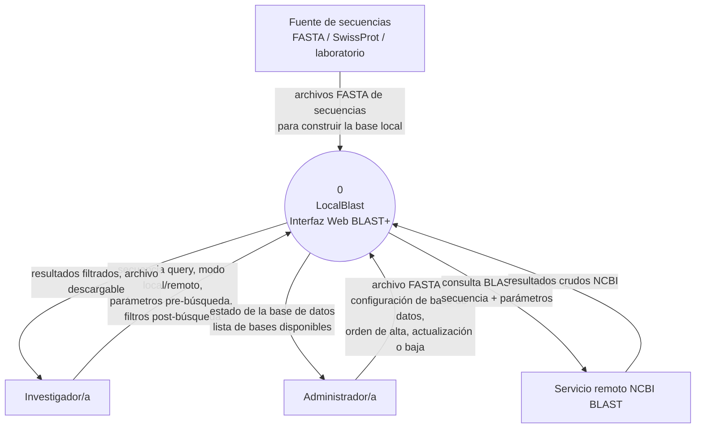
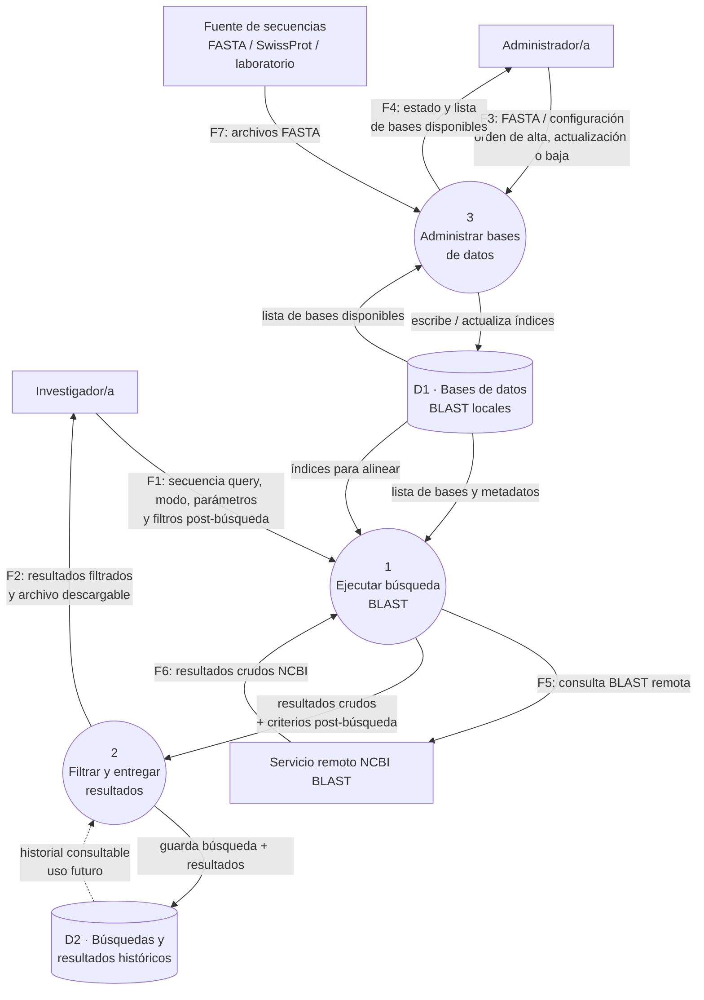

# Diagrama de Contexto — LocalBlast

Este documento contiene la representación DFD del sistema, siguiendo el instructivo de la cátedra: Nivel 0 (contexto — un único proceso 0 con sus entidades externas) y Nivel 1 (descomposición de ese proceso 0 en sus procesos internos, respetando la regla de balanceo de los flujos externos).

Los almacenes aparecen recién en Nivel 1, como corresponde.

---

## Nivel 0 · Diagrama de contexto

El sistema completo se representa como un único proceso (0), con sus cuatro entidades externas: los dos actores humanos (Investigador/a y Administrador/a) y los dos sistemas externos con los que dialoga (el servicio remoto de NCBI y las fuentes públicas o del laboratorio desde donde se obtienen las bases de datos BLAST).

**Cinco pares de flujos externos** que se preservan al bajar a Nivel 1:

| # | Origen | Destino | Contenido |
|---|---|---|---|
| F1 | Investigador/a | Sistema | Secuencia query + configuración de búsqueda (modo, parámetros, filtros) |
| F2 | Sistema | Investigador/a | Resultados filtrados y archivo descargable |
| F3 | Administrador/a | Sistema | Archivo o configuración de base de datos + orden (alta / actualización / baja) |
| F4 | Sistema | Administrador/a | Estado de las bases de datos disponibles |
| F5 | Sistema | NCBI | Consulta BLAST remota |
| F6 | NCBI | Sistema | Resultados crudos NCBI |
| F7 | Fuente externa | Sistema | Archivo FASTA de secuencias |

---

## Nivel 1 · Descomposición del proceso 0

El proceso 0 se descompone en **tres procesos internos**, más dos almacenes. La regla de balanceo se respeta: los siete flujos F1–F7 que cruzan el límite del sistema son los mismos que en Nivel 0, redistribuidos entre los procesos internos.

**Chequeo de balanceo**: los siete flujos externos F1–F7 aparecen en Nivel 1 exactamente con los mismos extremos externos que en Nivel 0. Solo cambia a qué proceso interno se conectan del lado del sistema.

---

## Descripción de los procesos y almacenes

### Procesos

- **P1 · Ejecutar búsqueda BLAST.** Recibe del investigador la secuencia query, el modo (local o remoto), los parámetros pre-búsqueda que afectan al algoritmo (E-value, matriz de sustitución, tamaño de palabra, penalizaciones de gap, etc.) y la elección de la base de datos. Valida la entrada, decide la ruta de ejecución y produce el conjunto crudo de alineamientos: en modo local invoca al binario BLAST+ contra los índices de D1; en modo remoto arma la consulta BLAST y la envía a NCBI, esperando el resultado.

- **P2 · Filtrar y entregar resultados.** Recibe los resultados crudos y los criterios de filtrado post-búsqueda que el usuario definió (por ejemplo umbrales de % identidad, cobertura, E-value, taxones), aplica esos filtros, arma la vista de resultados que se muestra en la interfaz y prepara el archivo descargable en el formato pedido (CSV, JSON, FASTA, tabular BLAST, XML). Al cerrar la búsqueda, escribe una copia del resultado en el historial D2.

- **P3 · Administrar bases de datos.** Es el proceso del rol Administrador. Recibe el archivo FASTA (subido por el admin o descargado desde una fuente pública como SwissProt) y las órdenes de alta, actualización o baja de una base local; construye los índices BLAST correspondientes usando `makeblastdb`; y mantiene actualizado el catálogo de bases disponibles que P1 va a ofrecer al investigador. Devuelve al administrador el estado del proceso (base creada, actualizada, con errores, etc.).

### Almacenes

- **D1 · Bases de datos BLAST locales.** Contiene los índices generados por `makeblastdb` (archivos `.nhr`, `.nin`, `.nsq` para nucleótidos o `.phr`, `.pin`, `.psq` para proteínas), junto con los metadatos del catálogo (nombre visible, tipo, fecha de alta, tamaño). Es lo que hace posible el modo local.

- **D2 · Búsquedas y resultados históricos.** Guarda la traza de cada búsqueda ejecutada (parámetros, base usada, timestamp) junto con su resultado, para que el usuario pueda volver a consultar o descargar sin repetir la ejecución. En esta primera versión del sistema solo se **escribe** en D2 (flujo lleno); la lectura (flujo punteado) queda documentada como uso futuro — no está en el alcance profundizado del cuatrimestre.

---

## Nota sobre el alcance profundizado

De los tres procesos identificados, el grupo lleva a profundidad **P1 (Ejecutar búsqueda BLAST)** y **P3 (Administrar bases de datos)** — ver la justificación en la sección "Selección de procesos a profundizar" del [SRS](../requirements/srs.md#5-selección-de-procesos-a-profundizar).
