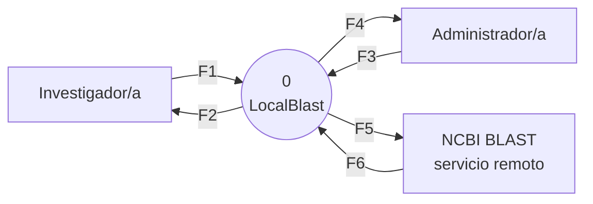
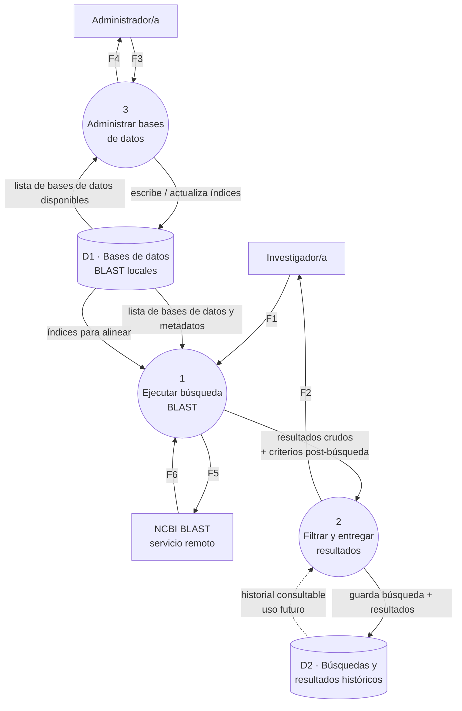

# Diagrama de Contexto — LocalBlast

Este documento contiene la representación DFD del sistema, siguiendo el instructivo de la cátedra: Nivel 0 (contexto — un único proceso 0 con sus entidades externas) y Nivel 1 (descomposición de ese proceso 0 en sus procesos internos, respetando la regla de balanceo de los flujos externos).

Los almacenes aparecen recién en Nivel 1, como corresponde.

Para mantener el diagrama legible, las etiquetas de las flechas se abrevian como **F1, F2, ...** y su contenido completo se lista en una tabla debajo de cada nivel.

---

## Nivel 0 · Diagrama de contexto

El sistema completo se representa como un único proceso (0), con sus tres entidades externas: los dos actores humanos (Investigador/a y Administrador/a) y el único sistema externo con el que dialoga (el servicio remoto de NCBI, para el modo remoto).

Los archivos FASTA — tanto la secuencia query del investigador como el FASTA para dar de alta una base de datos local — son **subidos** por los propios actores desde su equipo; el sistema no busca datos en ningún repositorio externo por su cuenta. Por eso, ni las fuentes públicas de secuencias (SwissProt, UniProt, etc.) ni los laboratorios en sí aparecen como entidades externas del diagrama: si un admin quiere cargar SwissProt como base de datos local, la descarga por fuera del sistema y sube el archivo resultante como si fuera cualquier otro FASTA.

**Tabla de flujos externos** (los mismos seis que van a preservarse en Nivel 1):

| # | Origen | Destino | Contenido |
|---|---|---|---|
| F1 | Investigador/a | Sistema | Archivo FASTA de la secuencia query, elección del programa BLAST, elección del modo, elección de la base de datos, parámetros pre-búsqueda y filtros post-búsqueda |
| F2 | Sistema | Investigador/a | Resultados filtrados y archivo descargable |
| F3 | Administrador/a | Sistema | Archivo FASTA para dar de alta la base de datos + tipo declarado (nucleótidos / proteínas) + orden de alta, actualización o baja |
| F4 | Sistema | Administrador/a | Estado y lista de bases de datos disponibles |
| F5 | Sistema | NCBI | Consulta BLAST remota |
| F6 | NCBI | Sistema | Resultados crudos NCBI |

---

## Nivel 1 · Descomposición del proceso 0

El proceso 0 se descompone en **tres procesos internos**, más dos almacenes. La regla de balanceo se respeta: los seis flujos F1–F6 que cruzan el límite del sistema son los mismos que en Nivel 0, redistribuidos entre los procesos internos.

**Chequeo de balanceo:** los seis flujos externos F1–F6 aparecen en Nivel 1 exactamente con los mismos extremos externos que en Nivel 0. Solo cambia a qué proceso interno se conectan del lado del sistema.

---

## Descripción de los procesos y almacenes

### Procesos

- **P1 · Ejecutar búsqueda BLAST.** Recibe del investigador el archivo FASTA con la secuencia query, la elección del programa BLAST (`blastn`, `blastp`, `blastx`, `tblastn`, `tblastx`), el modo (local o remoto), la base de datos elegida y los parámetros pre-búsqueda que afectan al algoritmo (E-value, matriz de sustitución, tamaño de palabra, penalizaciones de gap, etc.). Verifica la compatibilidad entre el programa BLAST elegido, el tipo de la secuencia query y el tipo de la base de datos, valida el resto de la entrada y decide la ruta de ejecución: en modo local invoca al binario BLAST+ contra los índices de D1; en modo remoto arma la consulta BLAST y la envía a NCBI, esperando el resultado. Produce el conjunto crudo de alineamientos.

- **P2 · Filtrar y entregar resultados.** Recibe los resultados crudos y los criterios de filtrado post-búsqueda que el usuario definió (por ejemplo umbrales de % identidad, cobertura, E-value, taxones), aplica esos filtros, arma la vista de resultados que se muestra en la interfaz y prepara el archivo descargable en el formato pedido (CSV, JSON, FASTA, tabular BLAST, XML). Al cerrar la búsqueda, escribe una copia del resultado en el historial D2.

- **P3 · Administrar bases de datos.** Es el proceso del rol Administrador. Recibe el archivo FASTA subido por el admin y el tipo declarado (nucleótidos o proteínas), junto con las órdenes de alta, actualización o baja de una base de datos local; construye los índices BLAST correspondientes usando `makeblastdb`; y mantiene actualizado el catálogo de bases de datos disponibles que P1 va a ofrecer al investigador. Devuelve al administrador el estado del proceso (base de datos creada, actualizada, con errores, etc.).

### Almacenes

- **D1 · Bases de datos BLAST locales.** Contiene los índices generados por `makeblastdb` (archivos `.nhr`, `.nin`, `.nsq` para nucleótidos o `.phr`, `.pin`, `.psq` para proteínas), junto con los metadatos del catálogo (nombre visible, tipo, fecha de alta, tamaño). Es lo que hace posible el modo local.

- **D2 · Búsquedas y resultados históricos.** Guarda la traza de cada búsqueda ejecutada (parámetros, base de datos usada, timestamp) junto con su resultado, para que el usuario pueda volver a consultar o descargar sin repetir la ejecución. En esta primera versión del sistema solo se **escribe** en D2 (flujo lleno); la lectura (flujo punteado) queda documentada como uso futuro — no está en el alcance profundizado del cuatrimestre.

---

## Nota sobre el alcance profundizado

De los tres procesos identificados, el grupo lleva a profundidad **P1 (Ejecutar búsqueda BLAST)** y **P3 (Administrar bases de datos)** — ver la justificación en la sección "Selección de procesos a profundizar" del [SRS](../requirements/srs.md#5-selección-de-procesos-a-profundizar).
