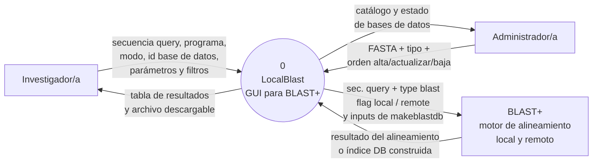
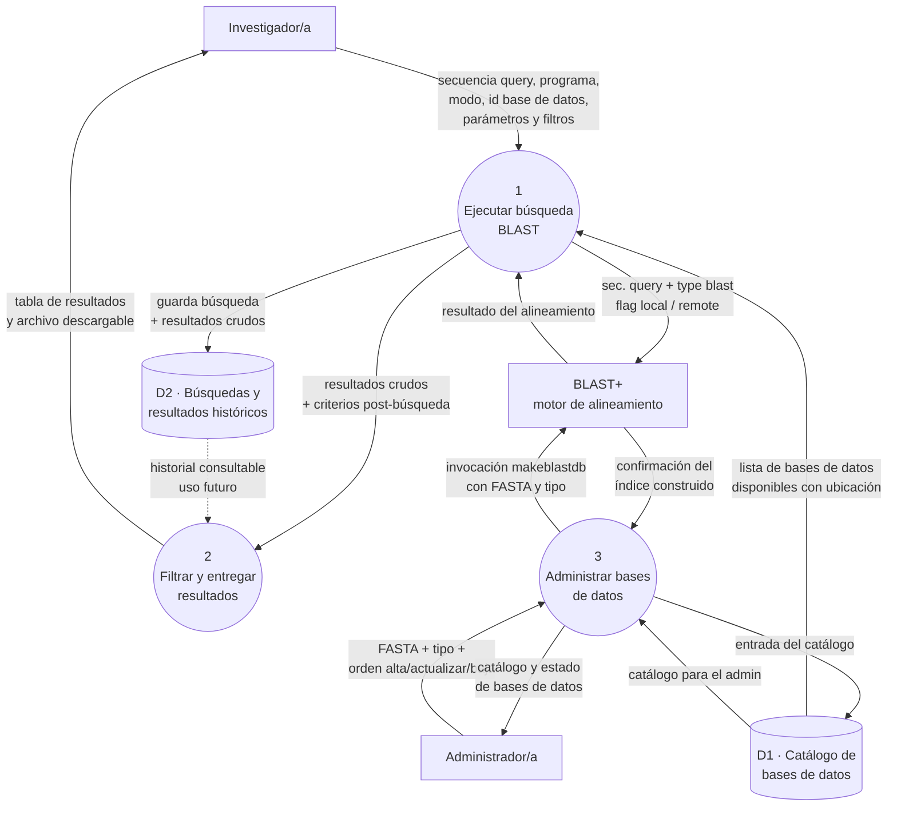

## Nivel 0 · Diagrama de contexto

El sistema completo se representa como un único proceso (0), con sus tres entidades externas: los dos actores humanos (Investigador/a y Administrador/a) y el único sistema externo con el que dialoga (**BLAST+**, el motor de alineamiento sobre el que se apoya).

**Aclaración sobre el modo local vs remoto.** Ambos modos son, desde el punto de vista de nuestra GUI, **una invocación al motor BLAST+**; la diferencia está enteramente del lado de BLAST+:

- En **modo local**, BLAST+ lee los índices de las bases de datos que residen en el mismo servidor.
- En **modo remoto**, BLAST+ recibe la flag `-remote` y él mismo se comunica con los servidores públicos de NCBI para resolver la búsqueda. Nuestro sistema no participa de ese diálogo.

Por eso desde el DFD ambos casos comparten los mismos dos flujos externos hacia BLAST+ (invocación y resultado). El comportamiento distinto de BLAST+ según la flag no cambia el diagrama de contexto de nuestro sistema.

## Nivel 1 · Descomposición del proceso 0

El proceso 0 se descompone en **tres procesos internos**, más dos almacenes. La regla de balanceo se respeta: los seis flujos externos que cruzan el límite del sistema son los mismos que en Nivel 0, redistribuidos entre los procesos internos.

**Chequeo de balanceo:** los seis flujos externos aparecen en Nivel 1 con los mismos extremos externos que en Nivel 0. Los que van hacia BLAST+ se dividen entre P1 (para búsqueda) y P3 (para construir índices), pero desde afuera del sistema siguen siendo los dos mismos flujos.

**Sobre la escritura en D2.** El flujo `guarda búsqueda + resultados crudos` sale de **P1** (no de P2) porque la persistencia debe ocurrir apenas la ejecución termina, independientemente de si el investigador luego filtra los resultados y/o los descarga. Esta decisión es consecuencia directa del modelado que hace el SRS: filtrar (`CU002`) y descargar (`CU003`) son capacidades opcionales que el investigador puede o no ejercer, y la búsqueda no debe perderse si no las ejerce. Ver la justificación completa en la sección [Selección de procesos a profundizar](../requeriments/srs.md#5-selección-de-procesos-a-profundizar) del SRS.

## Descripción de los procesos y almacenes

### Procesos

- **P1 · Ejecutar búsqueda BLAST.** Recibe del investigador el archivo FASTA con la secuencia query, la elección del programa BLAST (`blastn`, `blastp`, `blastx`, `tblastn`, `tblastx`), el modo (local o remoto), la base de datos elegida y los parámetros pre-búsqueda que afectan al algoritmo (E-value, matriz de sustitución, tamaño de palabra, penalizaciones de gap, etc.). Verifica la compatibilidad entre el programa BLAST elegido, el tipo de la secuencia query y el tipo de la base de datos, valida el resto de la entrada e **invoca a BLAST+** con la combinación correcta de opciones — incluida la flag `-remote` cuando el modo es remoto. Recibe de vuelta el conjunto crudo de alineamientos y, al finalizar la ejecución, **persiste la búsqueda y sus resultados crudos en D2**, para que el investigador pueda recuperarla más tarde independientemente de si la refina o descarga.

- **P2 · Filtrar y entregar resultados.** Recibe los resultados crudos y los criterios de filtrado post-búsqueda que el usuario definió (por ejemplo umbrales de % identidad, cobertura, E-value, taxones), aplica esos filtros, arma la vista de resultados que se muestra en la interfaz y prepara el archivo descargable en el formato pedido (CSV, JSON, FASTA, tabular BLAST, XML). P2 **no** escribe en D2: la persistencia ya la hizo P1 cuando terminó la ejecución.

- **P3 · Administrar bases de datos.** Es el proceso del rol Administrador. Recibe el archivo FASTA subido por el admin y el tipo declarado (nucleótidos o proteínas), junto con las órdenes de alta, actualización o baja de una base de datos local. **Invoca a BLAST+** con `makeblastdb` para construir los índices, y mantiene actualizado en D1 el catálogo de bases de datos disponibles (nombre visible, tipo, ubicación del índice, fecha) que P1 va a ofrecer al investigador. Devuelve al administrador el estado del proceso (base de datos creada, actualizada, con errores, etc.).

### Almacenes

- **D1 · Catálogo de bases de datos.** Contiene los **metadatos** de cada base de datos local disponible: nombre visible, tipo (nucleótidos / proteínas), ruta al conjunto de archivos de índice que produjo `makeblastdb`, fecha de alta, tamaño. Los archivos físicos de índice (`.nhr`, `.nin`, `.nsq`, etc.) los escribe y los lee **BLAST+**; nuestro sistema los registra en D1 pero no los interpreta.

- **D2 · Búsquedas y resultados históricos.** Guarda la traza de cada búsqueda ejecutada (parámetros, base de datos usada, timestamp) junto con su resultado **crudo** (antes de aplicar filtros post-búsqueda), para que el usuario pueda volver a consultar o descargar sin repetir la ejecución. En esta primera versión del sistema solo se **escribe** en D2 (flujo lleno, desde P1); la lectura (flujo punteado, hacia P2) queda documentada como uso futuro — no está en el alcance profundizado del cuatrimestre. Cuando esa lectura se profundice, permitirá al investigador iniciar `CU003` (descarga) directamente sobre una búsqueda del historial, sin ejecutar `CU001` de nuevo.
---

## Nota sobre el alcance profundizado

De los tres procesos identificados, el grupo lleva a profundidad **únicamente P1 (Ejecutar búsqueda BLAST)** durante el cuatrimestre. Los otros dos procesos (P2 y P3) quedan documentados a nivel de alcance en este DFD y en el modelo de dominio, pero **no** se detallan como casos de uso ni historias de usuario propios: no tienen RF profundizados en el SRS y no forman parte de la cadena `RF → CU → slice → HU` de este TP.

Los casos de uso escritos en `docs/requeriments/casos-de-uso.md` son **todos** derivados del proceso P1. Ver la justificación completa en la sección [Selección de procesos a profundizar](../requeriments/srs.md#5-selección-de-procesos-a-profundizar) del SRS.
