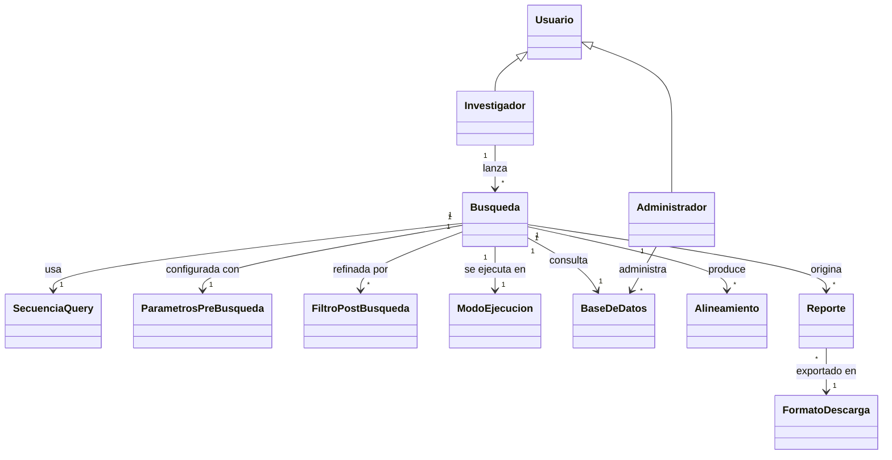

# Modelo de Dominio Conceptual — LocalBlast

Este modelo describe las **entidades esenciales del problema** y sus relaciones, en el nivel del TP1: sin atributos, sin tipos de dato, sin métodos ni visibilidad. El nivel de detalle interno de cada clase llega recién en el TP4 (diseño detallado).

Es un modelo del dominio del problema, no de la implementación: expresa "qué cosas existen y cómo se relacionan en el mundo del usuario", no cómo se van a codificar.

---

## Entidades y su rol en el dominio

**Usuario** — persona que interactúa con el sistema. Se especializa en dos roles:

- **Investigador** — quien lanza búsquedas BLAST. Es el actor principal del proceso de búsqueda.
- **Administrador** — quien mantiene el catálogo de bases de datos que el sistema ofrece para las búsquedas locales.

**Búsqueda** — la entidad central del dominio. Representa una consulta BLAST completa: una secuencia query enviada contra una base de datos, con un conjunto de parámetros del algoritmo, ejecutada en un modo (local o remoto), que produce alineamientos y da origen a reportes descargables.

**SecuenciaQuery** — la secuencia biológica (ADN, ARN o proteína) que el investigador quiere alinear.

**ParametrosPreBusqueda** — el conjunto de valores que afectan directamente al algoritmo BLAST: matriz de sustitución, E-value máximo, tamaño de palabra, penalización de gaps, y demás. Se llaman "pre" porque se fijan **antes** de correr la búsqueda y determinan cómo se calculan los resultados.

**FiltroPostBusqueda** — criterios que el investigador aplica **después** de que BLAST devolvió los alineamientos, para reducir la lista sin volver a ejecutar el algoritmo (por ejemplo umbrales de % de identidad, % de cobertura, rango de E-value observado, taxonomía).

**ModoEjecucion** — la elección entre correr BLAST localmente (contra un índice del catálogo del laboratorio) o remotamente (contra los servidores de NCBI, usando la opción `-remote` del BLAST+).

**BaseDeDatos** — una base de datos BLAST utilizable para una búsqueda. En modo local es un índice construido por `makeblastdb` (ya sea a partir de una base de datos pública como SwissProt, o de secuencias propias del laboratorio); en modo remoto es una base de datos ofrecida por NCBI.

**Alineamiento** — cada uno de los "hits" que devuelve BLAST: la comparación entre la query y una secuencia de la base de datos, con sus métricas asociadas (score, E-value, % identidad, cobertura, etc.).

**Reporte** — la salida entregable al usuario: la lista de alineamientos filtrados, en un formato descargable determinado.

**FormatoDescarga** — el formato en que se puede exportar un reporte (CSV, JSON, FASTA, tabular BLAST, XML).

---

## Notas de modelado

- La especialización `Usuario → Investigador / Administrador` refleja la **generalización de actores** del modelo de casos de uso: un mismo Usuario puede tener uno u otro rol (o ambos en organizaciones chicas). En el TP1 se documenta la especialización a nivel conceptual; las reglas concretas de autorización pertenecen al TP4.

- La `Busqueda` se relaciona con **una** `SecuenciaQuery` en esta versión. Búsquedas múltiples con varias queries en un mismo lote quedan fuera del alcance profundizado del cuatrimestre.

- `ParametrosPreBusqueda` y `FiltroPostBusqueda` son entidades **separadas** a propósito — es una distinción clave del dominio: los primeros cambian el resultado del algoritmo (hay que volver a ejecutar para probar otro valor), los segundos solo cambian qué se muestra al usuario (se aplican sobre resultados ya calculados).

- Este modelo va a **refinarse en las siguientes semanas** a medida que aparezcan casos de uso adicionales o slices con requerimientos nuevos. Es el estado inicial acordado por el grupo.
